# A serverless Slack app built with IBM Bluemix OpenWhisk, API Connect and Slack Events API

This sample shows how to build a serverless Slack app using Slack Events API to receive events,
with IBM Bluemix OpenWhisk actions to process these events,
and how to expose these actions with API Connect.

  
  
  
  
## Overview

Built using IBM Bluemix, the app uses:
* OpenWhisk - to implement the app bot and commands
* Cloudant - to keep track of app installations
* API Connect - to expose the OpenWhisk actions to Slack
* and Slack Events API.

When a user installs the app, or interacts with a bot user, or uses a custom command, Slack calls the app implementation.
It talks to an API deployed with API Connect.
In turn this API will invoke OpenWhisk actions.

From the perspective of the developer of the Slack app, there is no server involved:
only OpenWhisk actions and an API in API Connect. Furthermore the code is not running
if no user interacts with app and if the app gets popular, it will benefit from OpenWhisk scalability.


We will:
* prepare the OpenWhisk environment, creating the actions implementing our Slack app,
* create the Slack app in Slack,
* expose our OpenWhisk actions with API Connect,
* complete the integration by updating the endpoints in the Slack app,
* add our Slack app to a Slack team,
* test our Slack app.

## Requirements

To deploy this app, you need:
* IBM Bluemix account. [Sign up](https://console.ng.bluemix.net/?cm_mmc=GitHubReadMe) for Bluemix, or use an existing account.
* IBM Bluemix OpenWhisk early access. [Sign up for Bluemix OpenWhisk](https://new-console.ng.bluemix.net/openwhisk).
* Slack account

Your own Slack team is recommended if you want to play with the integration without impacting others.

## Prepare the OpenWhisk actions

With these steps we will deploy the actions implementing our Slack app.

### Get the code

* Clone the app to your local environment from your terminal using the following command:

  ```
  git clone https://github.com/IBM-Bluemix/openwhisk-slackapp.git
  ```
  
* or Download and extract the source code from
[this archive](https://github.com/IBM-Bluemix/openwhisk-slackapp/archive/master.zip)

### Create the Bluemix Cloudant service

1. Open the IBM Bluemix console

1. Create a Cloudant NoSQL DB service instance named **cloudant-for-slackapp**

1. Open the Cloudant service dashboard and create a new database named **registrations**

1. Select the database

1. Create a new document.

1. Replace the default JSON with the content of the file [cloudant-designs.json](cloudant-designs.json)

  
  
### Deploy OpenWhisk Actions

1. Copy the file named **template-local.env** into **local.env**

  ```
  cp template-local.env local.env
  ```

1. Get the service credentials for the Cloudant service created above and set CLOUDANT_url
in `local.env` to the corresponding value (url).

1. Ensure your OpenWhisk command line interface is property configured with:

  ```
  wsk list
  ```
  
  This shows the packages, actions, triggers and rules currently deployed in your OpenWhisk namespace.

1. Create the actions:

  ```
  ./deploy.sh --install
  ```

  If all goes well it outputs:
  
  ```
  Current namespace is <the-namespace-where-the-actions-are-deployed>.
  Adding app registration command
  ok: created action slackapp-register
  Adding app event processing
  ok: created action slackapp-event
  Adding app command processing
  ok: created action slackapp-command
  ```

  Note: the script can also be used to *--uninstall* the OpenWhisk artifacts to
  *--update* the artifacts if you change the action code, or simply with *--env*
  to show the environment variables set in **local.env**.

Our OpenWhisk actions are ready.

## Create the Slack app

### Create a new application

1. Proceed to the [new app creation](https://api.slack.com/apps/new)

1. Type a name for your app, a short description, a long description. Leave other fields empty.

  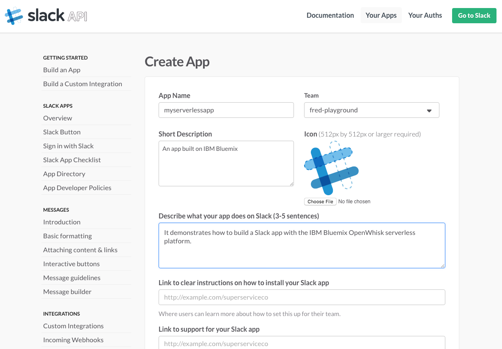

1. Click Create

  

### Add a bot user

1. Go to the **Bot Users** section of your app

  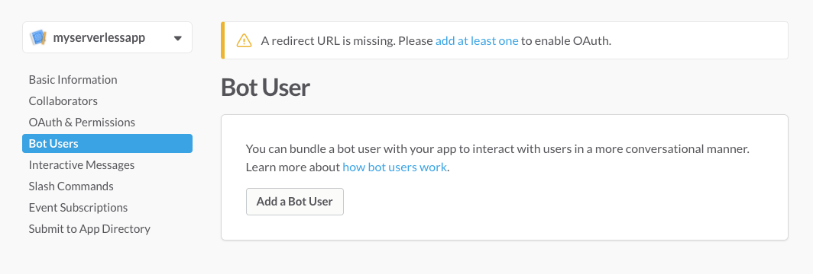

1. Click **Add a bot to this app**

1. Name your bot and click **Add bot user**

  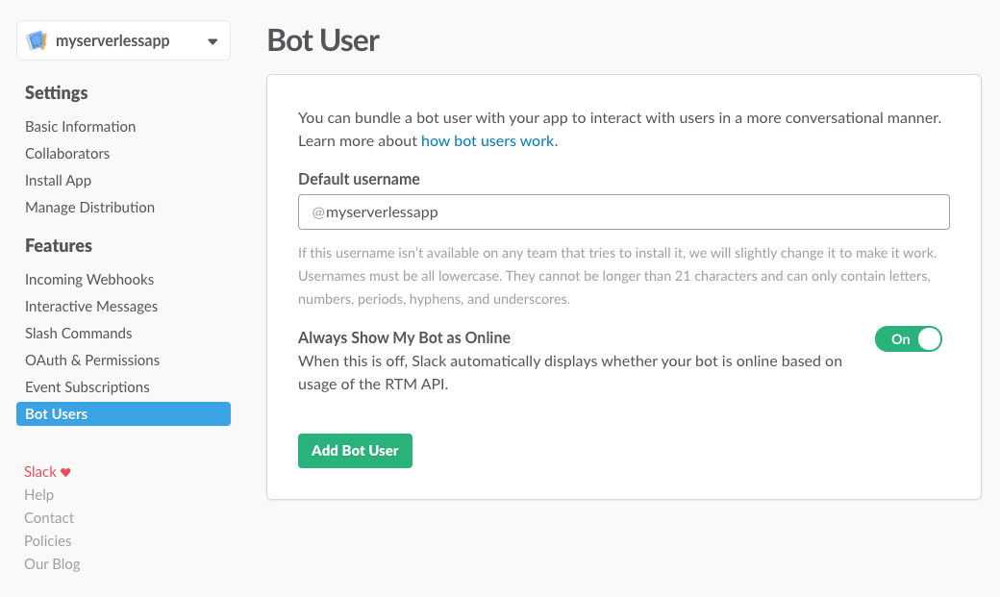
  
### Add an Event Subscription

1. Go to the **Event Subscriptions** section of your app

  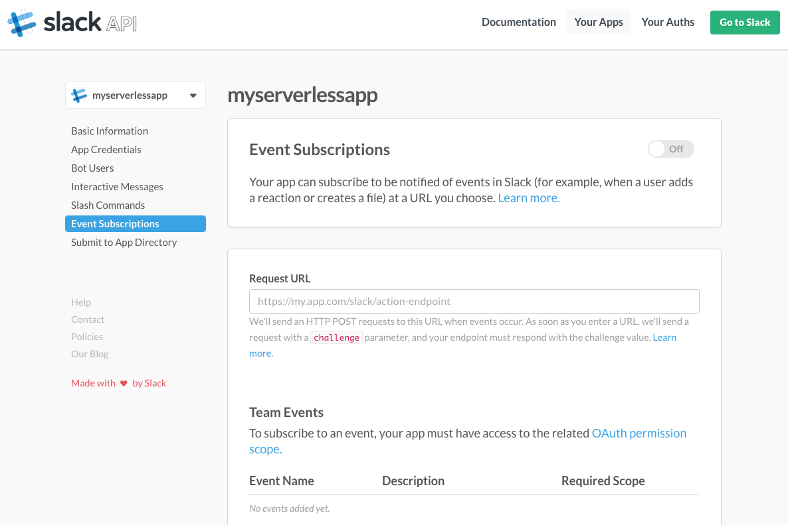

1. Add a new Bot User Event for **message.im**

  
  
  This allows us to react to direct messages sent to a bot.
  We could select more event type but for our simple app will only deal with this one today.

1. Save the changes

1. Go back to the **App Credentials** section of your app

1. Notice a Verification Token has been generated.
  This token is sent with every request from Slack so
  you can verify it is actually Slack calling you.

  

At that stage, we will put the configuration of the Slack app on hold.
For the next app configuration steps to work we need to have our OpenWhisk actions up and running
as Slack will ping them in the remaining configuration steps of the app to verify they are accessible.

We could not do this earlier as we also needed information from Slack,
specifically the App Credentials (client ID, client secret and verification token).

## Expose the OpenWhisk actions with API Connect

1. Back in the Bluemix console, create a new API Connect instance named **apiconnect-for-slackapp**.

  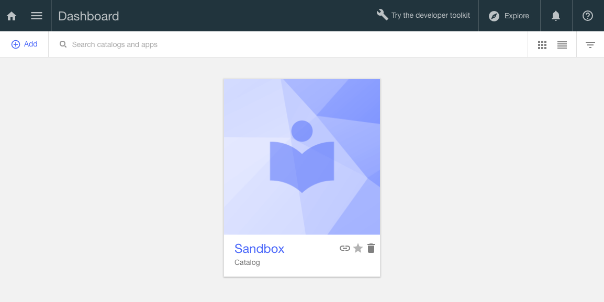

1. Go to Drafts

  

1. Import OpenAPI

  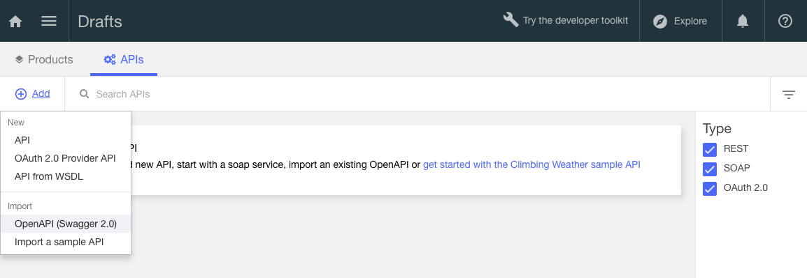

1. Select the [api/definitions/openwhisk-slackapp-api.yaml](api/definitions/openwhisk-slackapp-api.yaml) file from your checkout directory.

  This OpenAPI defines three API methods. These methods will be called by Slack when a user
  installs the app in his team (*/slack/oauth*), when an event occurs on the Events API (*/slack/event*),
  when someone uses a custom command (*/slack/command*).

  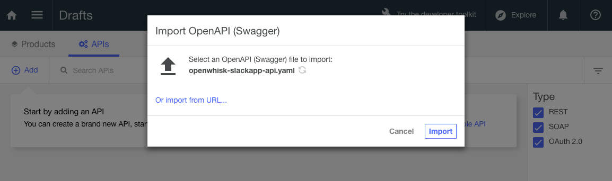

1. Import

  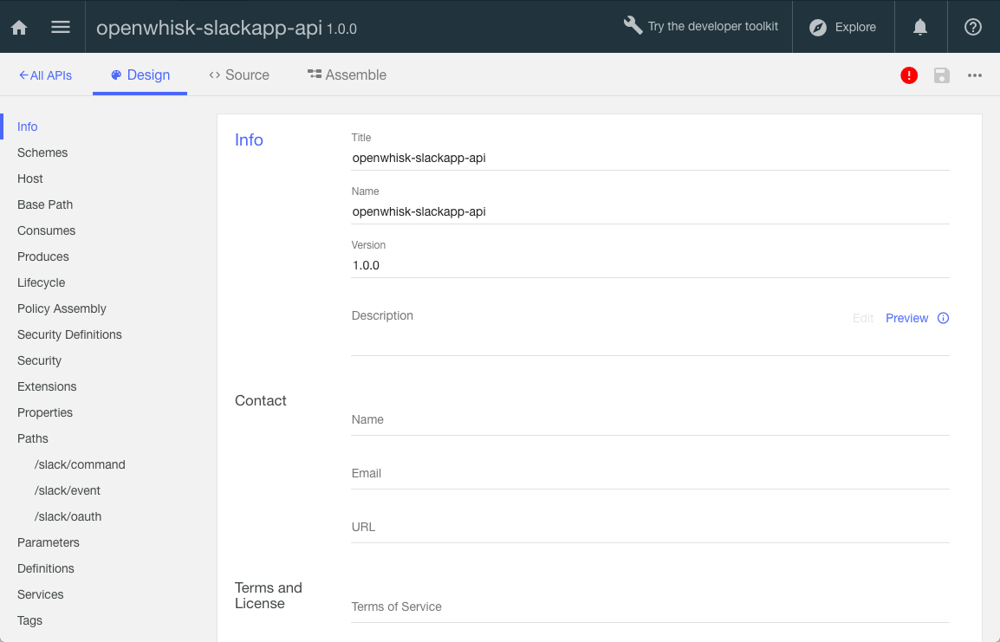

1. Select the Properties section

  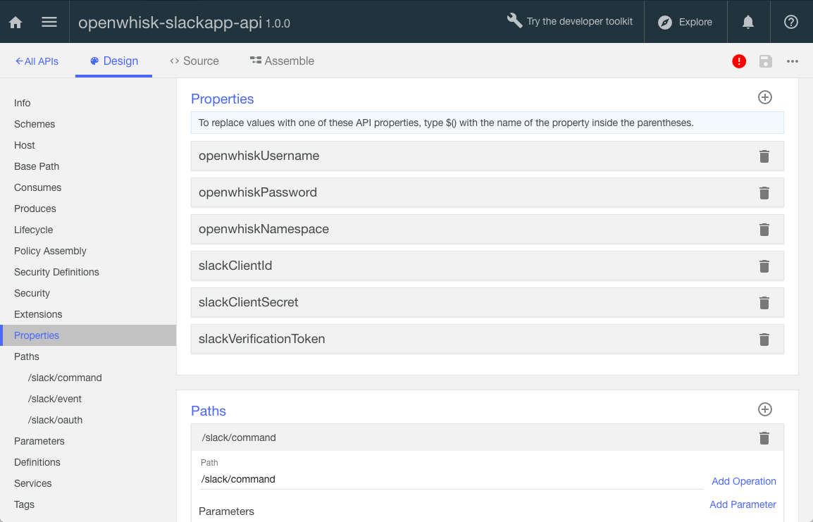
  
  1. Set the OpenWhisk username and OpenWhisk password.
  You can find these credentials by running ```wsk property get```
  and looking at the whisk auth property.
  Everything before the **:** is your username, everything after is the password.
  
  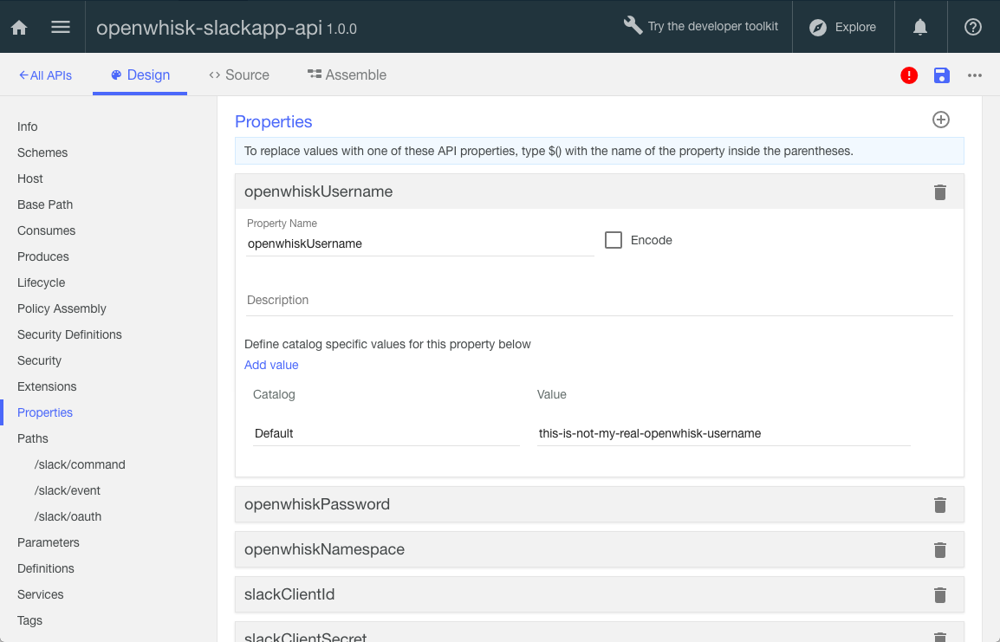

  1. Set the OpenWhisk namespace where the actions where deployed.
  Find it with ```wsk property get --namespace```
  
  1. Set the Slack Client ID. Find it in the **App Credentials** in Slack.
  
  1. Set the Slack Client Secret. Find it in the **App Credentials** in Slack.
  
  1. Set the Slack Verification Token. Find it in the **App Credentials** in Slack.
  
1. Save the API Definition using the Save icon in top right corner.

1. Generate a default product from this API.

  This is the step that will expose our OpenWhisk actions through API Connect.

  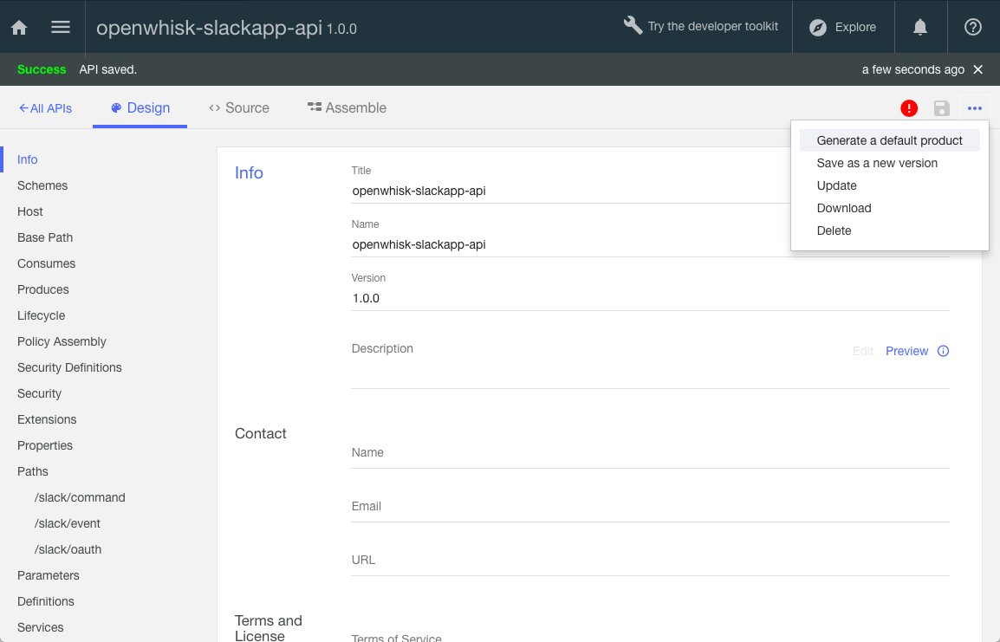

  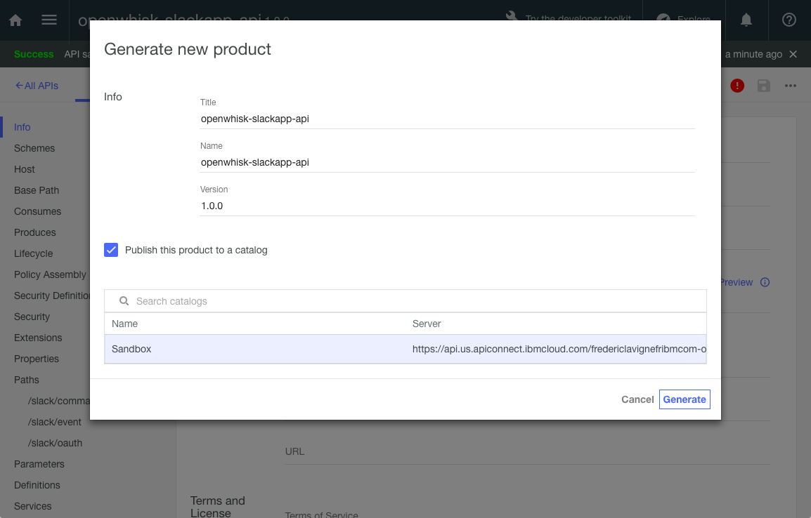

1. View the API published in the Sandbox

  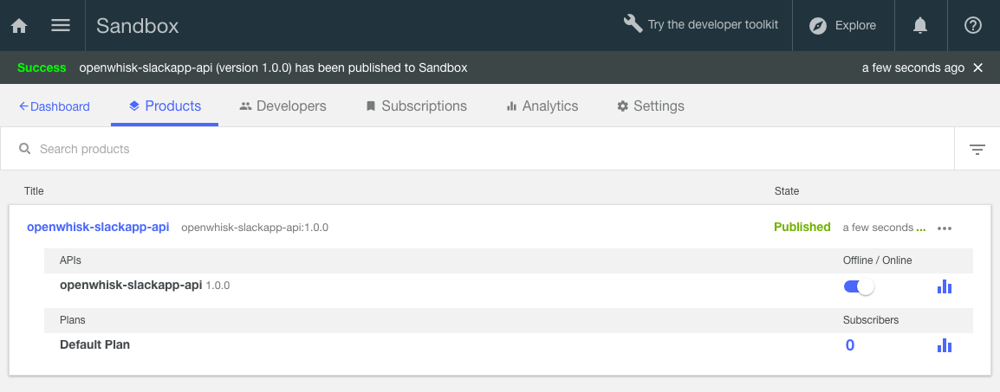

1. Go to the API Connect dashboard

  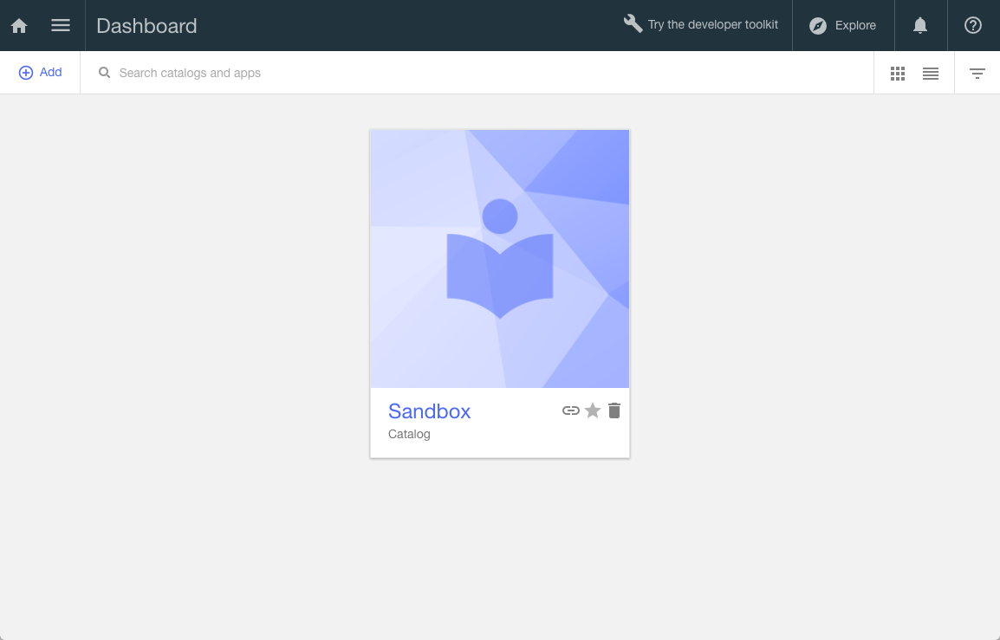

1. Select the Sandbox catalog. The Sandbox is a default catalog where we published the API.

1. Select the Settings

1. Select the Endpoints

  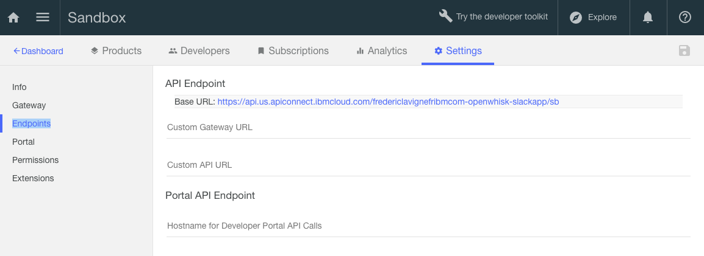

1. Make note of the API Endpoint Base URL, we will need it for the remaining configuration of the Slack app.

## Complete the Slack App Configuration

### Set the callback URL for authentication

1. Under App Credentials, add the URI for the authentication of your app.
This URI will be called when a user installs your application in his team.
The value is the API Endpoint Base URL (retrieved earlier)
followed by /api/slack/oauth such as:

  ```
  https://api.us.apiconnect.ibmcloud.com/yourorg-yourspace/sb/api/slack/oauth
  ```

  
  
1. Click **Save Changes**

### Set the callback URL to receive events

1. Under Event Subscriptions, set the Request URL to the
API Endpoint Base URL followed by /api/slack/event. Such as:

  ```
  https://api.us.apiconnect.ibmcloud.com/yourorg-yourspace/sb/api/slack/event
  ```

  

  Slack will contact this URL immediately. It should turn to **Verified** if the API Connect configuration steps worked.

1. Enable Event Subscriptions

  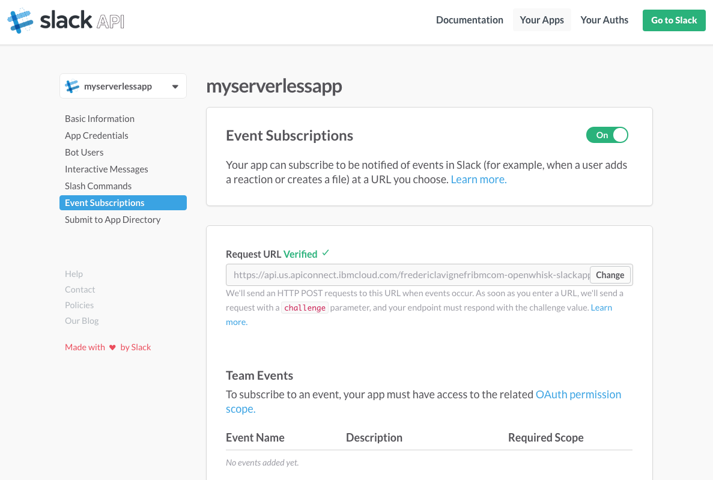

1. Save Changes

### Create a new command

1. Under Slash Commands, **Create new command**

  

1. Set the values

  1. Command: **/myserverlessapp**

  1. Request URL: API Endpoint Base URL followed by /api/slack/command such as:
  
    ```
    https://api.us.apiconnect.ibmcloud.com/yourorg-yourspace/sb/api/slack/command
    ```
  
  1. Short Description: **A test command**
  
  1. Usage Hint: **[param1] [param2]**

  

1. Save

Our app is finally ready to be installed!

## Add the app to your team

1. To see what's happening behind the scene as Slack calls our OpenWhisk actions, open a new command prompt and run

  ```
  wsk activation poll
  ```

  Leave it running. Actions triggered by Slack will show up there
  
1. Go to [Slack Add Button page](https://api.slack.com/docs/slack-button)

1. Scroll down to the **Add the Slack button** section

1. Pick you app from the dropdown list

1. Uncheck incoming webhook, check commands and bot

  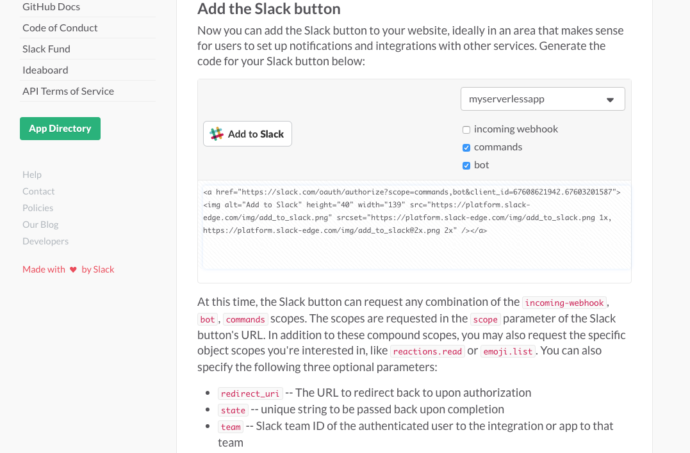
  
1. Press **Add to Slack**

1. Select your team

  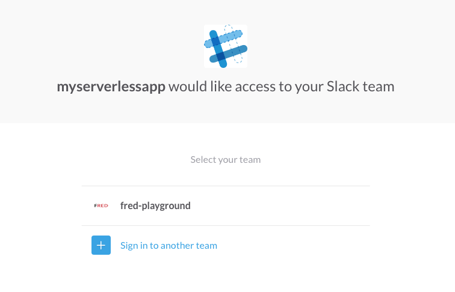

1. Authorize the app

  

  After a few seconds, the app is installed. You should see logs appearing in the OpenWhisk activation
  polling as Slack will be sending the registration info we will use later to interact with Slack channels and users.
  
  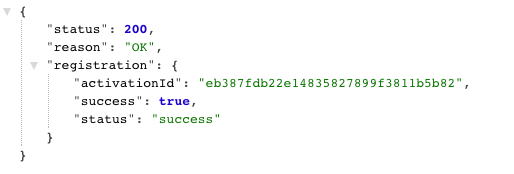

  This is a response coming from our API Connect flow.
  Ideally you would redirect to another page once the registration is completed.
  
## Test the integration

1. Go into your team in Slack

1. Send a direct message to our new bot friend

  
  
  Note: you will notice the bot appears offline.
  This is a current issue with Slack when using the new Events API.
  [The Slack team is aware and working on a fix](https://twitter.com/l2fprod/status/762649353601318912).
  
  

1. The bot replies

  

1. Go to the #general channel (although this could work from any place in Slack) and type ```/my``` you should see the custom command

  

1. Try the command ```/myserverless two params``` as example

  

## Code Structure

### OpenWhisk - Deployment Script

| File | Description |
| ---- | ----------- |
|[**deploy.sh**](deploy.sh)|Helper script to install, uninstall, update the OpenWhisk actions.|

### OpenWhisk - Actions

| File | Description |
| ---- | ----------- |
|[**actions/slackapp-register.js**](slackapp-register.js)|Handles the installation of the app in a team. It stores the authorization token in Cloudant for future use by the bot and commands.|
|[**actions/slackapp-event.js**](slackapp-event.js)|Handles events triggered by the Events API. In this sample, it handles messages sent to the bot user and simply echoes the message sent by the user.|
|[**actions/slackapp-command.js**](slackapp-command.js)|Handles custom commands. In this sample, it echoes the command parameters.|

### API Connect - API

The API definition was created with the API Connect developer kit, installed with ```npm install -g apiconnect```.
You don't need to install this kit to deploy or update the sample.

| File | Description |
| ---- | ----------- |
|[**api/definitions/openwhisk-slackapp-api.yaml**](openwhisk-slackapp-api.yaml)|Declares 3 operations called by the Slack app.|

API Connect is key in the sample as it provides the gateway between our Slack app and our OpenWhisk actions implementing the app.

It defines 3 operations:

  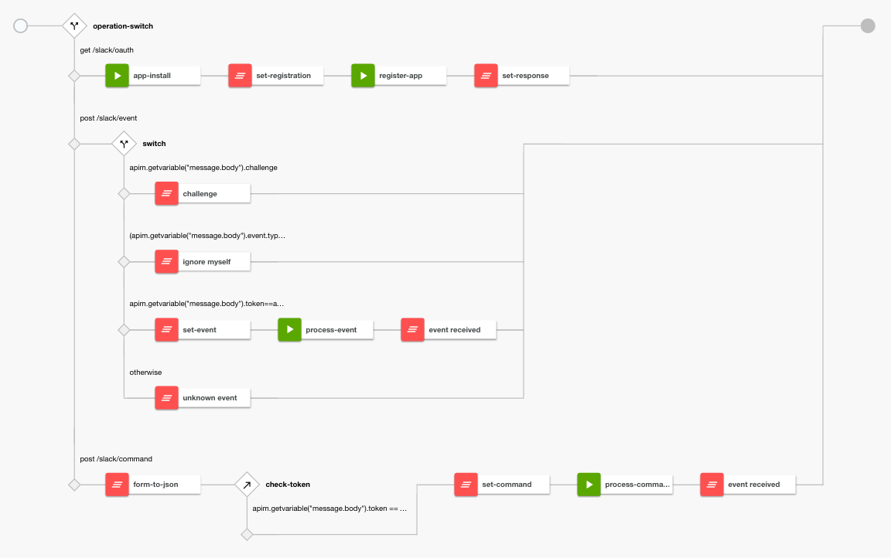

* **GET /slack/oauth**

  * Called by Slack as part of the authorization flow when installing a new API.
  * Upon receiving the authorization request from Slack, it calls back Slack *app-install* to confirm it has received the request.
  * Slack replies and provides the authorization token to be used by our app to interact with Slack.
  * The flow invokes the registration OpenWhisk action **register-app** to store the token for later.

* **POST /slack/event**

  * Called by Slack Events API whenever an event we have registered interest for is triggered.
  * It switches based on the content of the event.
  * The **challenge** is a special case called only once in the lifecycle of the app when you configure the Event Subscription. It simply returns the challenge to Slack. No OpenWhisk action involved here.
  * The **ignore myself** filters bot_message. It is a shortcut for this app to not have to deal with its own message or messages from other integrations.
  * The **set-event** invokes the event processing action but first it checks if the event token is the verification token issued by Slack.
  * Other events are ignored.
  
* **POST /slack/command**

  * Called by Slack when someone triggers a custom command
  * Slack posts the command arguments as *application/x-www-form-urlencoded*.
  * **form-to-json** converts the form parameters to a JSON object for consumption by the remaining flow.
  * after checking the token, the command processing action is invoked.
  
## Contribute

Please create a pull request with your desired changes.

## Troubleshooting

### OpenWhisk

Polling activations is good start to debug the OpenWhisk action execution. Run
```
wsk activation poll
```
and send a message to the bot or use a custom command.

## License

See [License.txt](License.txt) for license information.